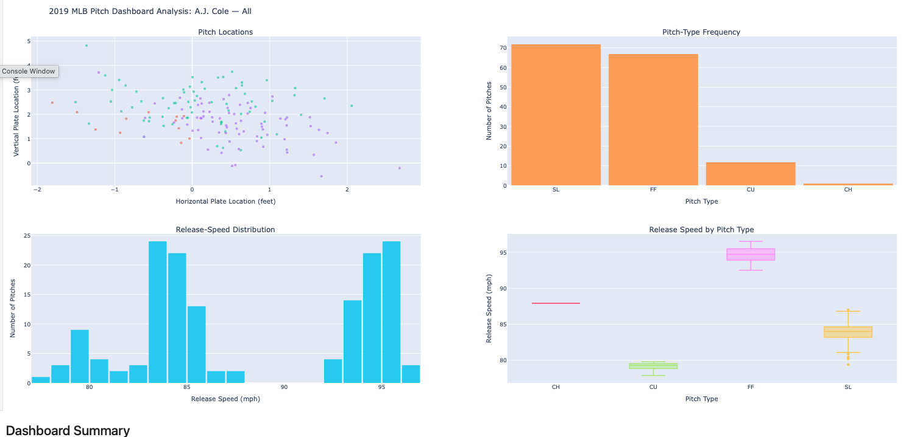

# Interactive MLB Pitch Dashboard

## Dashboard Preview

## Overview

This project explores 2019 Major League Baseball (MLB) Statcast pitching data through an interactive dashboard built with Python. Users can filter the data by pitcher and pitch type while four coordinated visualizations update simultaneously.

This project was completed as part of **SIADS 521: Visual Exploration of Data** at the University of Michigan.

---

## Features

- Interactive pitcher selection
- Interactive pitch type filtering
- Four coordinated visualizations
- Hover tooltips with detailed pitch information

---

## Dashboard Visualizations

The dashboard includes four visualization types:

- **Scatter Plot** – Displays the horizontal and vertical location of each pitch.
- **Bar Chart** – Shows the frequency of each pitch type.
- **Histogram** – Displays the distribution of pitch release speeds.
- **Box Plot** – Compares release speeds across pitch types.

---

## Technologies Used

- Python
- Pandas
- Plotly Express
- Plotly Graph Objects
- ipywidgets
- Jupyter Notebook

---

## Repository Contents

- `Interactive_MLB_Pitch_Dashboard.ipynb` – Complete notebook containing the analysis and interactive dashboard.

---

## Future Improvements

Potential enhancements include:

- Strike zone overlay
- Additional filtering options
- Batter-specific analysis
- Multi-season comparisons

---

## Running the Dashboard

1. Clone or download this repository.
2. Install the required dependencies listed in `requirements.txt`.
3. Download the dataset from Google Drive:
   https://drive.google.com/file/d/1RJL0peFRkKG3WgYfv0z6fLXzVvog6aBj/view?usp=sharing
4. Extract the downloaded ZIP file so that a folder named `pitch_data` is located in the same directory as `Interactive_MLB_Pitch_Dashboard.ipynb`.
5. Open the notebook in JupyterLab or Google Colab.
6. Run all cells from top to bottom.

5. ## Data

The 2019 MLB Statcast dataset used for this dashboard is hosted separately because it exceeds GitHub's browser upload size limit.

Google Drive:
https://drive.google.com/file/d/1RJL0peFRkKG3WgYfv0z6fLXzVvog6aBj/view?usp=sharing

The dashboard notebook is available in this repository.

## Author

Itab Ahmed

Master of Applied Data Science (MADS)

University of Michigan# Interactive-MLB-Pitch-Dashboard
An interactive data visualization dashboard that explores 2019 MLB pitching data using coordinated charts and interactive filtering.
